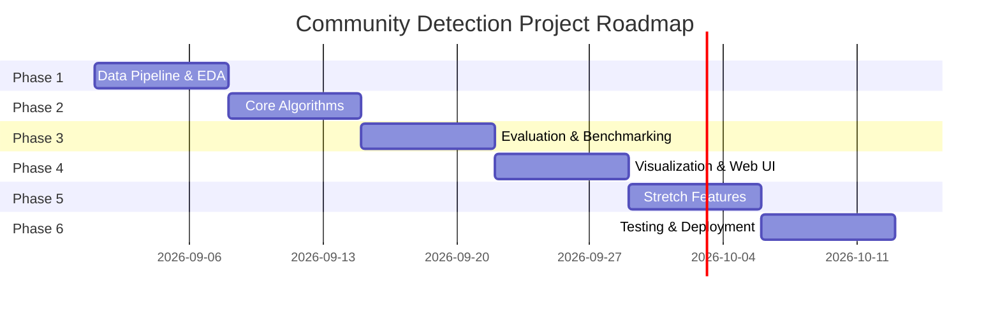

# Community Detection in Social Networks — End-to-End Project Development Plan

## 1. Project Overview

- **Title**: Community Detection in Social Networks
- **Objective**: Design and implement an end-to-end system that identifies tightly-knit groups (communities) of nodes within social network graphs, where nodes represent users/entities and edges represent relationships/interactions (follows, friendships, co-authorships, messages, etc.).
- **Problem Statement**: Social networks are large, complex graphs. Understanding their underlying structure — friend circles, interest clusters, echo chambers, or influencer clusters — requires algorithms that can partition the graph into meaningful sub-groups without prior ground-truth labels. This project constructs an end-to-end pipeline that ingests network data, executes multiple community detection algorithms, evaluates their partition quality, and visualizes the results interactively.
- **Real-World Applications**:
  - **Recommendation Systems**: Suggest friends, groups, or content within a discovered community.
  - **Targeted Marketing & Advertising**: Identify organic audience segments for targeted campaigns.
  - **Fraud & Bot Ring Detection**: Uncover coordinated inauthentic behavior or dense sybil clusters.
  - **Epidemiology & Information Diffusion**: Model transmission patterns and spread barriers across clusters.
  - **Organizational Network Analysis**: Understand cross-team collaboration, silos, and key bridges.

---

## 2. Scope & Objectives

| Goal | Description |
| :--- | :--- |
| **Core** | Detect communities using at least 3 distinct algorithmic paradigms (Louvain, Girvan-Newman, Label Propagation). |
| **Evaluation** | Empirically compare algorithms using Modularity ($Q$), Normalized Mutual Information (NMI), Adjusted Rand Index (ARI), and Conductance. |
| **Visualization** | Interactive graph visualization with color-coded community clusters, node inspector, and layout physics. |
| **Interface** | Web app enabling users to upload custom datasets/graphs or select real-world benchmarks, run detections, and inspect metrics. |
| **Stretch** | Dynamic/temporal community detection, Leiden algorithm, and Graph Neural Network / Node2Vec embedding-based clustering. |

---

## 3. Datasets

| Dataset | Type | Scale | Notes |
| :--- | :--- | :--- | :--- |
| **Zachary's Karate Club** | Classic Benchmark | 34 nodes, 78 edges | Ground truth: 2 factions |
| **American College Football** | NCAA Division I-A | 115 nodes, 613 edges | Ground truth: 12 conferences |
| **Facebook Ego Network / Circles** | SNAP Dataset | ~4,000 nodes (or ego subsets) | Real-world social circles |
| **Academic Co-Authorship** | DBLP Network | 120+ nodes, 995+ edges | Ground truth: 3 sub-disciplines |
| **LFR Synthetic Benchmark** | Synthetic Graphs | Configurable ($N, \mu$) | Controlled mixing parameter $\mu$ for rigorous stress-testing |
| **Custom Upload** | Edge-list / CSV | Dynamic | User-supplied social interaction CSV |

**Sources**: [Stanford SNAP](https://snap.stanford.edu/data/), Kaggle, NetworkX built-in generators, DBLP.

---

## 4. Tech Stack

| Layer | Technology | Details |
| :--- | :--- | :--- |
| **Language** | Python 3.10+ | Core development language |
| **Graph Processing** | NetworkX, igraph | Graph modeling, centrality, topology analysis |
| **Community Algorithms** | `python-louvain`, `networkx.algorithms.community`, `leidenalg`, `scikit-learn` | Louvain, Girvan-Newman, LPA, Spectral Clustering |
| **Embeddings & ML (Stretch)** | Node2Vec, PyTorch Geometric / GNN | Representation learning and embedding clustering |
| **Backend & Web Server** | Flask / FastAPI | REST API, graph caching, file upload handlers |
| **Frontend & UI** | HTML5 / CSS3 / JavaScript (or Streamlit) | Modern dark-mode dashboard, Cytoscape.js / Vis.js / PyVis |
| **Visualization** | Vis.js / PyVis / Plotly / Matplotlib | Interactive canvas rendering, physics-directed graph layout |
| **Deployment** | Docker, Render, Vercel, Streamlit Cloud | Containerized or serverless hosting |
| **Version Control** | Git + GitHub | CI/CD and repository versioning |

---

## 5. System Architecture

```
┌────────────────────────────────────────────────────────┐
│                    Data Ingestion                      │
│        (CSV Upload / SNAP Datasets / Built-in)         │
└───────────────────────────┬────────────────────────────┘
                            │
                            ▼
┌────────────────────────────────────────────────────────┐
│                  Graph Construction                    │
│     (NetworkX Graph, Self-loop & Isolate Removal)      │
└───────────────────────────┬────────────────────────────┘
                            │
         ┌──────────────────┼──────────────────┐
         │                  │                  │
         ▼                  ▼                  ▼
  ┌──────────────┐   ┌──────────────┐   ┌──────────────┐
  │   Louvain    │   │Girvan-Newman │   │    Label     │
  │ (Modularity) │   │ (Betweenness)│   │ Propagation  │
  └──────┬───────┘   └──────┬───────┘   └──────┬───────┘
         │                  │                  │
         └──────────────────┼──────────────────┘
                            │
                            ▼
┌────────────────────────────────────────────────────────┐
│                   Evaluation Module                    │
│      (Modularity Q, NMI, ARI, Conductance, Speed)      │
└───────────────────────────┬────────────────────────────┘
                            │
                            ▼
┌────────────────────────────────────────────────────────┐
│               Visualization & REST API                 │
│      (JSON Node-Edge Payload, Color assignments)       │
└───────────────────────────┬────────────────────────────┘
                            │
                            ▼
┌────────────────────────────────────────────────────────┐
│                   Interactive Web UI                   │
│   (Graph Explorer, Metric Comparison, Custom Upload)   │
└────────────────────────────────────────────────────────┘
```

---

## 6. Algorithms to Implement & Compare

1. **Louvain Method**: Modularity optimization via greedy hierarchical agglomeration ($\mathcal{O}(N \log N)$). Fast, standard baseline.
2. **Girvan-Newman**: Divisive hierarchical method iteratively pruning high edge-betweenness centrality bridges ($\mathcal{O}(M^2 N)$). Highly interpretable, best on small-to-medium graphs.
3. **Label Propagation Algorithm (LPA)**: Asynchronous dynamic diffusion where nodes iteratively adopt majority neighbor label ($\mathcal{O}(M + N)$). Near-linear, no prior community count needed.
4. **Spectral Clustering**: Graph Laplacian eigen-decomposition followed by $k$-means clustering on normalized eigenvectors.
5. **Leiden Algorithm** *(Enhanced Louvain)*: Guarantees well-connected communities and eliminates disconnected sub-clusters.
6. *(Stretch)* **Node2Vec + K-Means**: Random-walk biased feature representation mapped into vector space and clustered via $k$-means.
7. *(Stretch)* **Graph Neural Networks (GCN/GraphSAGE)**: Node feature and structural attribute co-clustering.

---

## 7. Evaluation Metrics

| Metric | Formula / Meaning | Interpretation |
| :--- | :--- | :--- |
| **Modularity ($Q$)** | $Q = \sum_{c} \left( \frac{e_c}{M} - \left(\frac{d_c}{2M}\right)^2 \right)$ | $[-0.5, 1.0]$. $>0.3$ implies significant community structure. |
| **Normalized Mutual Information (NMI)** | $\frac{2 I(C_{\text{true}}; C_{\text{pred}})}{H(C_{\text{true}}) + H(C_{\text{pred}})}$ | $[0, 1]$. Matches ground truth partition accurately when close to 1. |
| **Adjusted Rand Index (ARI)** | $\frac{\text{RI} - E[\text{RI}]}{\max(\text{RI}) - E[\text{RI}]}$ | $[-1, 1]$. Measures pair-wise clustering agreement adjusted for chance. |
| **Conductance ($\phi$)** | $\frac{\lvert E(S, \bar{S}) \rvert}{\min(\text{Vol}(S), \text{Vol}(\bar{S}))}$ | Lower is better (fewer cut edges relative to internal density). |
| **Runtime & Scalability** | Execution latency in milliseconds (ms) | Benchmarked against increasing node/edge scale. |

---

## 8. Step-by-Step Implementation Plan



### Phase 1 — Setup & Data Pipeline (Week 1)
- Set up repository structure, virtual environment, and dependency manifest (`requirements.txt`).
- Implement data ingestion loaders for CSV edge-lists, GML formats, and SNAP benchmarks.
- Implement Exploratory Data Analysis (EDA): node/edge counts, degree distribution, density, connected components.

### Phase 2 — Core Algorithm Implementation (Week 2)
- Implement Louvain, Label Propagation, Girvan-Newman, and Spectral Clustering modules.
- Standardize output format across all algorithms:
  ```python
  def detect_communities(G: nx.Graph, **kwargs) -> dict:
      return {
          "name": str,
          "communities": list[list],
          "partition": dict[node, comm_id],
          "num_communities": int,
          "modularity": float,
          "time_ms": float
      }
  ```

### Phase 3 — Evaluation Module (Week 3)
- Implement automated calculations for Modularity ($Q$), Conductance, NMI, and ARI against available ground truths.
- Generate unified benchmark comparison tables and comparative bar charts.

### Phase 4 — Visualization & Web Interface (Week 4)
- Interactive network visualization utilizing physics-based force simulation (Vis.js / Cytoscape.js).
- Build web application with dataset selector, parameter controls, CSV uploader, and real-time metric scorecards.

### Phase 5 — Stretch Goals (Week 5)
- Integrate Node2Vec embedding generation + K-Means clustering.
- Add dynamic/temporal community detection tracking partition evolution over time.
- Implement community keyword / topic explainability if node metadata is present.

### Phase 6 — Testing, Documentation & Deployment (Week 6)
- Comprehensive test suite (`pytest`) covering loaders, algorithm runners, and metric edge cases.
- Finalize documentation: `README.md`, API guides, presentation scripts, and deployment configurations (`Dockerfile`, Render / Vercel configs).

---

## 9. Suggested Folder Structure

```
community-detection-project/
│
├── data/
│   ├── raw/                           # Original datasets (GML, SNAP txt, CSV)
│   └── processed/                     # Pre-cleaned edge-lists
│
├── src/ (or root modules)
│   ├── data_loader.py                 # Graph ingestion & cleaning
│   ├── algorithms/
│   │   ├── __init__.py
│   │   ├── louvain.py                 # Louvain modularity
│   │   ├── girvan_newman.py           # Divisive betweenness
│   │   ├── label_propagation.py       # LPA
│   │   ├── spectral.py                # Graph Laplacian clustering
│   │   └── leiden.py                  # Leiden algorithm
│   ├── evaluation.py                  # Modularity, NMI, ARI, Conductance
│   ├── visualization.py               # Plotly / Matplotlib export helpers
│   └── embeddings.py                  # Node2Vec / GNN stretch module
│
├── app/                               # Web application
│   ├── app.py                         # Flask / FastAPI server
│   ├── templates/                     # HTML templates
│   └── static/                        # CSS, JS, Vis.js assets
│
├── notebooks/
│   └── eda_and_experiments.ipynb      # Exploration, benchmarks & figures
│
├── tests/
│   └── test_algorithms.py             # Unit tests
│
├── sample_social_network.csv          # Example user dataset for upload testing
├── requirements.txt                   # Project dependencies
├── Dockerfile                         # Deployment container
├── README.md                          # Documentation
└── PROJECT_PLAN.md                    # This Project Plan
```

---

## 10. Deliverables

1. **Modular Codebase**: Clean, tested Python modules with standard signatures and robust error handling.
2. **Interactive Web Application**: Responsive UI supporting built-in benchmarks and custom CSV edge-list upload.
3. **Comparative Evaluation Matrix**: Quantitative benchmark across Modularity, NMI, ARI, Conductance, and latency.
4. **Interactive Graph Visualizations**: Force-directed color-coded community diagrams.
5. **Presentation Guide & Final Report**: Comprehensive documentation and viva voce Q&A guide.
